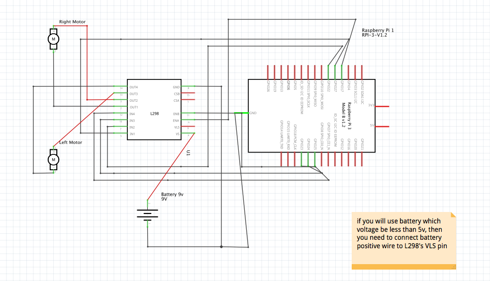

# line-tracker-robot-with-raspberry-pi-camera
This is a line tracker robot based in raspberry pi using camera. Tested in Vex robotics kit
At the first you need to install all necessary packages in requirements.txt
This is the parts which we used
  1. Usb camera LifeCam VX-800
  2. Raspberry Pi 3 model B+
  3. 12v 3000mAh Battery
  4. L298 motor shield
  5. Male to male jumper wires
  6. 2 or 4 DC motors

